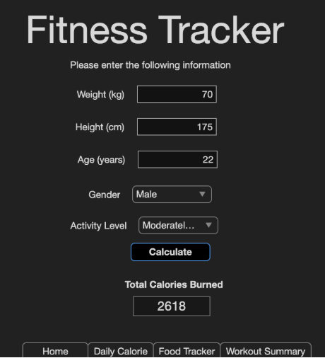
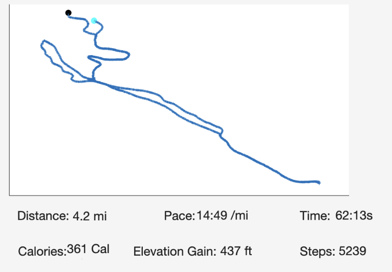
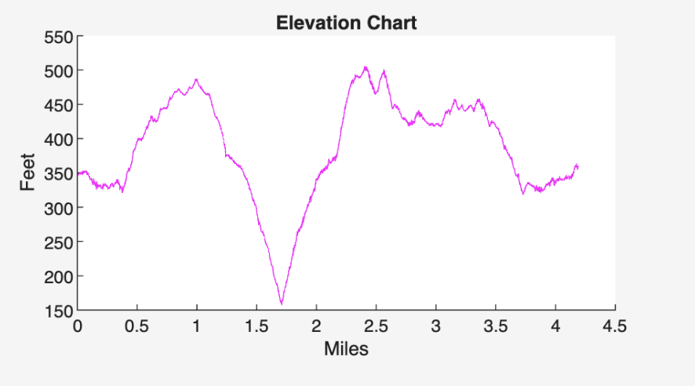
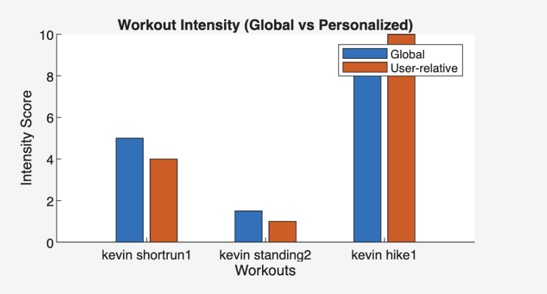
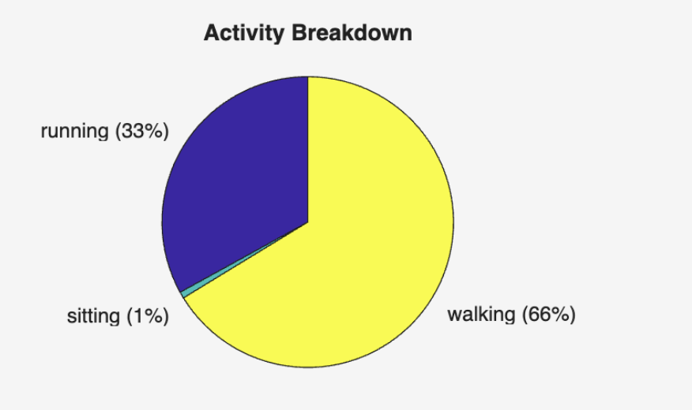
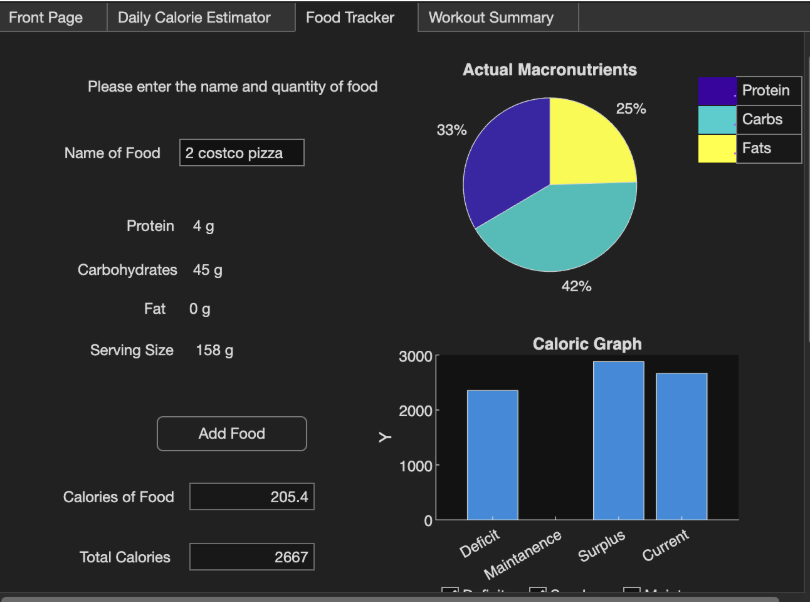
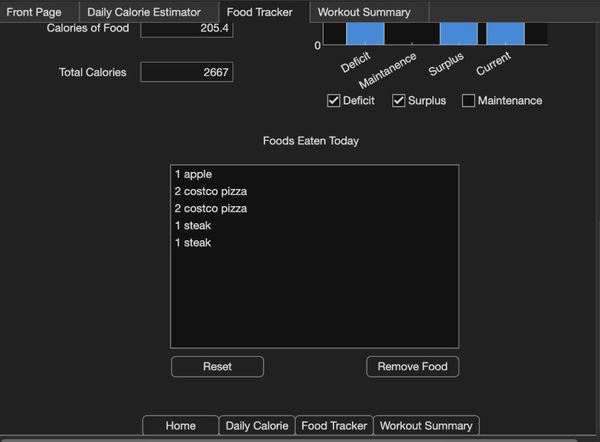
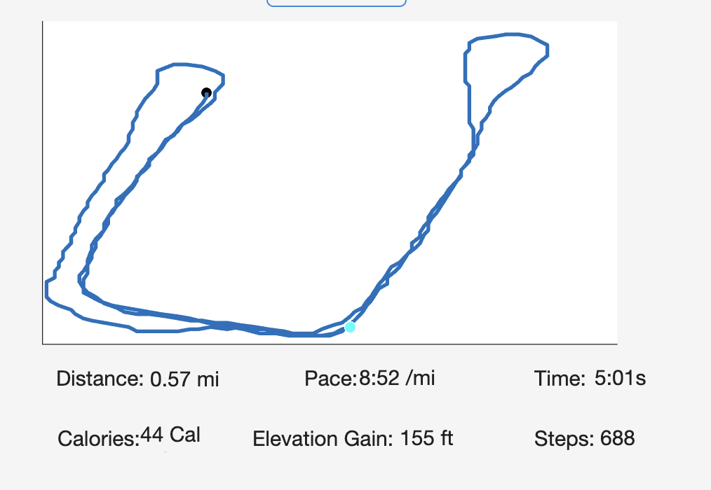

## MATLAB Mobile FitnessTracker App

**Group 17 Participants: Justin, Kevin, Tenzin**


**Project Description:**
We developed an application that tracks both the user's fitness activities and food intake throughout the day, allowing them to create a personalized plan to help reach their goals. Our motivation stemmed from the understanding that fitness and diet are crucial elements in achieving objectives such as weight loss, strength building, or enhancing longevity. The technology stack we employed consisted primarily of MATLAB for the backend and App Designer for the graphical user interface. One of our main challenges was training our models to accurately classify activities. We addressed this by utilizing MATLAB Mobile to collect data on the transition from walking to running on various types of terrain. Ultimately, the project culminated in a functional app that not only presents valuable data regarding fitness and diet but also provides users with a tailored plan to guide them on their journey to success.

##Instructions to run the FitnessTracker App

1. Clone the github repository:
    ```bash
    git clone git@github.com:Justin-pyth/matlab-mobile-fitness-tracker.git
    ```

2. Open FitnessTracker.mlapp
    by clicking on the file name 
    or 
    opening FitnessTrackerModel.m and running the following command
    ```matlab
    app = FitnessTracker();
    ```

3. Enter information onto the Daily Calorie Estimator tab

4. Navigate to Food Tracker and enter name of foods and quantity you had. Examples below:
      ```
        2 costco pizzas
        3 eggs
        1 steak
      ```

5. Navigate to workout summary, and select workouts from the Data/MixedActivity Folder.
       Recommended files to select:
        ```
        kevin_hike1.mat
        kevin_longrun1.mat
        kevin_shortrun1.mat
       ```

**Methods/Results:**
The core aspect of the project involves training different models to distinguish between different segments of a workout and accurately classify their characteristics. We used diverse datasets to train the models, utilizing MATLAB’s Machine Learning tool, specifically the Classification Learner. Below, we explain how we trained three distinct models for our project.

1. Trained Model on Acceleration:  
This model differentiates between running, walking, and sitting by analyzing acceleration in the x, y, and z directions. We observed significant improvements in accuracy when comparing our model with a baseline trained specifically on flat terrain, as we initially misclassified many walking segments as running due to insufficient training on the vertical axis. By collecting new data from activities on varied terrains, including uphill and downhill slopes, we retrained the model, thereby enhancing its classification capabilities.

2. Trained Model on Altitude:  
Our objective for this model was to accurately calculate total elevation gain, focusing solely on ascents during uphill movement. Traditional methods encountered challenges due to natural elevation fluctuations in the recorded data. To overcome this, we employed machine learning techniques instead of conventional algorithms. Our diverse dataset included recordings from uphill, downhill, and flat terrains, featuring various activities, which allowed for precise measurements and visual representations of elevation gain.

3. Regression Model:
	This model was made to accurately find the intensity of a given sensor data (workout) file. The model was trained upon 7 features (with an emphasis on the steps and duration) of each data file. These features include “steps”, “duration”, “distance”, “avgPace”, “avgAccel”, “maxAccel”, and “altGain”. Note: These features are not readily available data found from the MatLab mobile app sensors. These features were calculated from a combination of the acceleration, angular velocity, and position sensors. Once our data was collected, labeled on accurate Intensity values and appended to one table “WorkoutData.mat” The model allows for seamless prediction of how intense a given user workout is, using the trained data. Note: The training of this regression model (using the regression learner tool) was found more effective than using the classification learner tool, given the intended output of a numerical value from 1-10, instead of a classification of certain concepts.

**Daily Calorie Estimator:**
Calculates daily caloric intake to maintain weight based on the user’s weight, height, age, gender, and activity level.



**Workout Summary:** 
	This app page provides users with information and analysis of their recent workouts. Once a user selects a given MATLAB sensor file (created using the MATLAB mobile app sensor feature), users are given a multitude of graphs. These graphs include:
	
 	-MapWorkout Graph: The MapWorkout graph provides a top-down view of the user’s route during the workout. It displays key metrics such as distance, pace, time, calories burned, elevation gain, and steps taken.



	-Elevation Chart: Displays the total elevation gain over the course of the workout.   


 
	-Workout Intensity (Global vs Personalized): The Workout Intensity graph compares global intensity, which represents the user’s total effort across all workouts, with user-relative intensity, which reflects the intensity of each individual workout. This allows users to see how a single workout compares to their overall performance.


 
	-Activity Breakdown: The Activity Breakdown graph shows the percentage of time spent on different activities. In this example, the user spent 66% of the time walking, 33% running, and 1% sitting.



**Food Tracker:**
Takes user input for food items and displays information about it such as the protein, fat, carbs, serving size of the food given, total calories of the food, and total calories the user has consumed so far. An interactable food list at the bottom of the page where you’re able to remove foods from the list or completely reset them is given as well. The data is displayed through text, pie charts, and bar charts.



**Functionality:** 
The total calories that the user has consumed for the day and total calories of the food imputed is displayed through text and different charts. The macronutrients of the food are displayed through a pie chart in the top right. Below it are the current calories the user has eaten for the day displayed through a bar chart. In addition to the current calories eaten, there’s the option to display the amount of calories you would need to eat to be in a calorie surplus, deficit, or to maintain. This is done through checking off the surplus, deficit, and maintenance check boxes respectively. The calories for the surplus, deficit, and maintenance are all based on the information given on the daily calorie estimator page. There is a list of the foods eaten at the bottom of the page with buttons to remove specific foods or reset the list of foods entirely. All of the food data was gathered using the nutrionix API. It’s able to parse the human language to get the proper data to be displayed. The connection to the API is done through the getNutritionData.m file. The API key and ID use a burner account to perform the connection to the API.


### Layout
(what each folder/file contains) and how to interact with it

**FitnessTracker.mlapp -**
-The main MATLAB App, which includes pages such as a calorie calculator, food tracker, and workout summary. Backend is handled by several functions that perform extraction and computation.
-For the charts, pressing the home button while hovering over them will reset the zoom 

**ActivityFunctions**
-A folder that consists of MATLAB functions that convert sensor data into activities readable by humans

**HelperFunctions**
-A folder consisting of MATLAB functions that perform calculations or aid in the functionality of the app

**Data** 
-A folder containing all the sensor data used, recorded from MATLAB mobile. Mainly used to train, validate, and test our trained models. Also included are mixed activities that display relevant data for the user, aiming to support their fitness goals. The data is sorted based on the different activities done such as walking, running, or going uphill or downhill.

**HackathonFiles**
-The original files that this project is based off of

**img**
-Holds images used in the app

**Models**
-The trained machine learning models used to classify data including altitude, intensity, and different types of activity

**IntensityRL**
-A folder holding almost all files related to creating the regression model. Holds the tester file to create simulated data, the regression model session (if model replication is necessary), and the userHistory file, holding the workout data from the Intensity Graph on the Workout Summer Tab on the application.
-All functions are used in the app to display or calculate data. They act as regular matlab functions

**Breakdown of what each student did** 

**Kevin** - App Designer, trained two models (acceleration and altitude), created activity functions, and served as a data collector for running, walking, and standing on different types of terrain

**Tenzin** - App Designer, trained regression model on 7 calculated features, made functions in activity functions folder, collected real and simulated training data, and graphs, model creation calculations

**Justin** - App Designer, Food Tracker UI, connected nutritionix API to app to get food information to be displayed on app and stored, collected training data for activity models, tested deep learning viability



